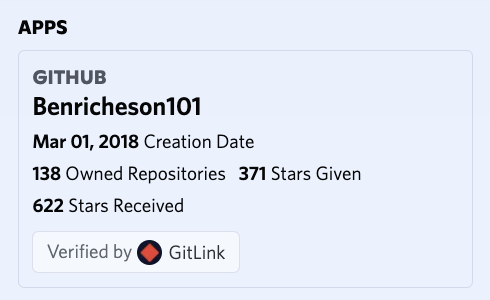
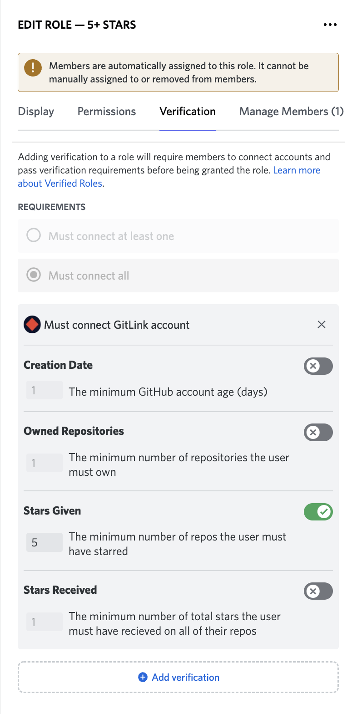
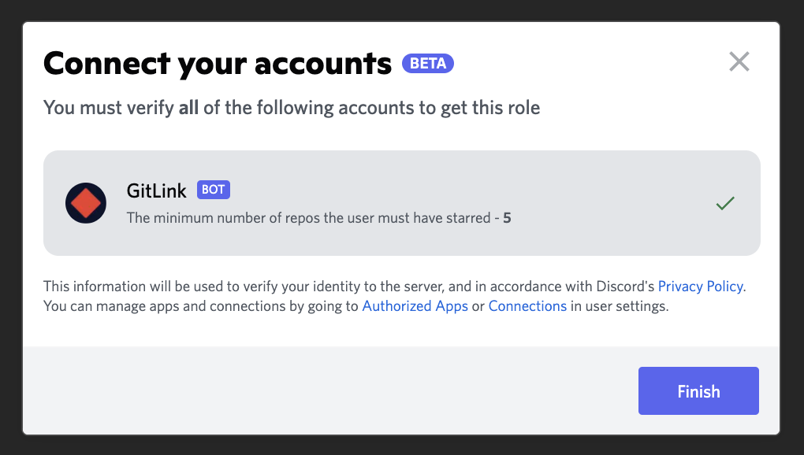

<h1 align="center">GitLink 🔗</h1>

Simple Verified Roles for GitHub!

# Usage

1. [invite the bot](https://gitlink.dev/invite)
2. create a role requiring GitLink verification
  
3. to add a verified role, click the server icon > Verified Roles, and choose the one you would like to add
  
